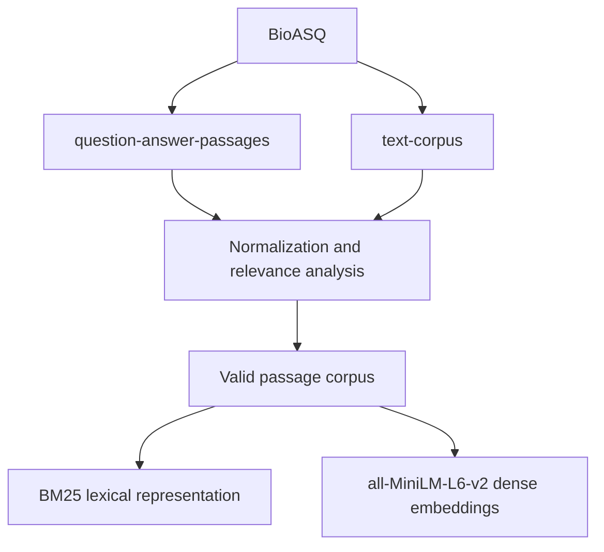
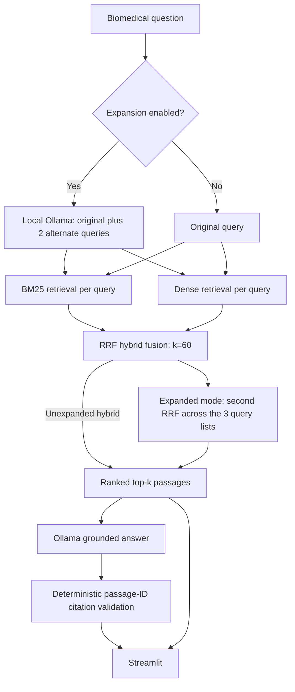

# Biomedical Hybrid Search RAG architecture

## Offline data and indexing

`rag-datasets/rag-mini-bioasq` exposes `question-answer-passages` (test questions,
answers, and JSON-encoded relevance IDs) and `text-corpus` (passages).
Normalization preserves every original ID and duplicate-text row; parses relevance
IDs; flags invalid text and questions whose relevant passages are all invalid.
Only 27,977 valid passages out of 40,221 enter either index. There are 4,719 questions.

BM25 uses lowercase letter/digit tokens. Dense retrieval uses the dot product of
L2-normalized embeddings for cosine similarity. Both preserve original passage
IDs. Embeddings are rebuilt once per in-memory retriever at startup; Streamlit
caches retrievers. No vector database or persistent embedding index is used.

## Online query flow

Lexical and dense UI modes also expose their individual rankings directly.
RRF contributes `1 / (60 + rank)` for each list containing a passage, then sorts
by summed score (original passage ID breaks ties). Candidate depth equals top-k.
Expansion preserves the original query verbatim and validates exactly two
nonempty distinct alternates. No retrieval implementation was changed.

Generation receives the original question and selected retrieved passages only.
It requests concise evidence-based claims with `[passage_id]` citations. Missing
citations or IDs outside that supplied context reject the answer. Insufficient
evidence displays `Insufficient evidence in the retrieved passages.` Citation
membership is not a factual-entailment check. The UI displays
`Source link: not available in dataset` because source URLs are absent.

Ollama is called using standard-library HTTP, with installed model
`hf.co/Qwen/Qwen3-4B-GGUF:Q4_K_M` by default (`OLLAMA_MODEL` is configurable).
There is no cloud API key. Local generation and judging have $0 external API cost,
not zero compute cost. MiniLM is general-purpose; local answer quality depends
on the installed model and hardware.

## Frozen retrieval evaluation

Fixed 100 BioASQ queries → identical saved query IDs for each configuration →
Recall@5, Recall@10, MRR@10, nDCG@10, and search latency.
Selection uses seed 42 and the saved `data/eval/queries_100.json`. Original
relevance labels include invalid passage IDs; these are retained in denominators.
Latency excludes corpus loading and index construction. Existing JSON results
are preserved unchanged; no evaluation was rerun during this migration.

| Mode | Recall@5 | Recall@10 | MRR@10 | nDCG@10 | Mean latency |
| --- | ---: | ---: | ---: | ---: | ---: |
| Lexical | 0.4293 | 0.5029 | 0.8306 | 0.6228 | 80.5 ms |
| Dense | 0.3040 | 0.3993 | 0.6659 | 0.4829 | 14.2 ms |
| Hybrid | 0.4360 | 0.5268 | 0.7943 | 0.6185 | 92.6 ms |

Hybrid has the strongest measured Recall@5/Recall@10; lexical has the strongest
MRR@10/nDCG@10. Results show a trade-off rather than one dominant configuration.
Expanded-hybrid 100-query metrics were not measured. The frozen evaluation
runner and legacy CLI still contain historical OpenAI-key guards for LLM modes;
use Streamlit for the migrated local RAG flow. Frozen provider-specific tests
have not been adapted or rerun.

## Minimal LLM evaluation

Question + reference answer + retrieved context + generated answer → local
Ollama judge → correctness, groundedness, context relevance (each 1–5 with a short
reason). The configured model, fixed prompt, seed, and temperature 0 stay fixed
for a run. Scores are heuristic and may be biased, particularly with the same
model generating and judging. Citation validity is computed separately by the
existing deterministic validator, never scored by the judge. Verification is
limited to the single Hirschsprung smoke example, not a benchmark.

The smoke question is “What genes are associated with Hirschsprung disease?”.
Its judge reference combines existing BioASQ answers for question IDs 0 and 1285;
it is not an exact-question gold label or a retrieval benchmark. Some GGUF chat
templates emit a reasoning preamble despite `think=false`; answer parsing keeps
only the final text after `</think>` before applying unchanged citation checks.
